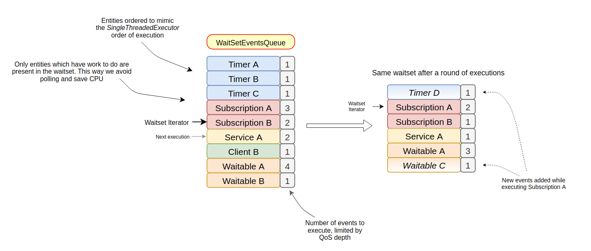

{:toc}

# {{ page.title }}

{{ page.abstract }}

Original Author: {{ page.author }}

## Motivations

Many articles have discussed the CPU overhead of the default ROS 2 executor the `SingleThreadedExecutor` and of its improved version the `StaticSingleThreadedExecutor`.
 - [Reducing ROS 2 CPU overhead by simplifying the ROS 2 layers](https://discourse.ros.org/t/reducing-ros-2-cpu-overhead-by-simplifying-the-ros-2-layers/13808)
 - [SingleThreadedExecutor creates a high CPU overhead in ROS 2](https://discourse.ros.org/t/singlethreadedexecutor-creates-a-high-cpu-overhead-in-ros-2/10077)
 - [ROS 2 Middleware Change Proposal](https://discourse.ros.org/t/ros2-middleware-change-proposal/15863)

We can identify some major contributors to this overhead:
 - The cost of modifying and updating waitsets.
   Currently this operation happens multiple times for every iteration of the executor, even if the majority of robotics systems are mostly static, i.e. the number of ROS 2 entities is fixed and known at startup.
   A detailed walk-through of the waitset management process can be found [here](https://discourse.ros.org/t/ros2-middleware-change-proposal/15863/6).
 - Inefficiency of the timers management.
   This is currently done in the rcl layer, where at each iteration the full list of timers associated with an executor is checked twice.
 - The presence of several abstraction layers that do not simply forward data, but rather perform non trivial operations, between the application and the underlying middleware.
 
The CPU overhead of ROS 2 with respect to other pub/sub systems (as the same DDS middlewares that it uses under the hood), makes it difficult to integrate ROS 2 on embedded platforms with constrained resources, as a not negligible amount of CPU is needed just for the executor to identify entities with work to do.
 
## Requirements
 
The following requirements have been taken account for the design of a new ROS 2 executor:
 - Good performance: the executor shall not be the CPU bottleneck of a ROS 2 system, thus allowing to obtain performance comparable to the ones of the underlying middleware that is being used.
 - Scalability: The executor must perform well independently of the system size, e.g. the latency for processing a fixed amount of messages must be independent from the number of entities.
   This can flow into the "You don't pay for what you don't use" paradigm.
 - Extensibility: The executor should set a base from which it is straight-forward to add more functionalities without impacting performances or requiring heavy modifications of the ROS2 core libraries.
 - Ordering of events: The executor should process events in the same order they have occurred.
 - High precision and accurate timers: The executor should provide mechanisms to ensure that timers are executed with the minimum possible latency.
 
## The Events Executor

In order to address the aforementioned requirements, we designed the so-called `EventsExecutor`.
The `EventsExecutor` inherits from the base `Executor` class.
The main difference between this and the other executor implementations is that the `EventsExecutor` does not use the concept of a waitset.
The `EventsExecutor` is characterized by two main components, i.e. the `EventsQueue` and the `TimersManager`.

### Brief Overview

In order to execute generic ROS 2 entities, the `EventsExecutor` relies on an event queue.
Whenever a ROS 2 entity that is associated to the executor has work to do, it will push an event into the executor's queue.
Then the executor can process these events in a FIFO manner, without need for expensive entities look-ups.
Processing an event results in different operations depending on the entity that generated it.

Timers are monitored in a separate task by a timers manager, where they are kept in a priority queue sorted according to their expiration time.
The task then has to monitor only the first element of the queue and can execute its callback as soon as it expires.
The timers manager can also push timer events into the queue, instead of executing the timer.

### EventsQueue

The `EventsExecutor` requires that all the entities as soon as they have some work to do, they push an event into the executor's `EventsQueue`.
Events might be produced in the RMW layer, i.e. where the underlying middleware notifies the ROS 2 entity that there is new work to do, but events can also be produced in the rclcpp layer.
Events are executed in the rclcpp layer by the `EventsExecutor`.
The event data structure that is pushed into the `EventsQueue` must contain all what is needed for the executor to be able to process that particular event.
The data structure so includes the type of the entity that generated the event and a handle to its corresponding rclcpp object.

Considering the entities currently available in ROS 2, the content of the event data structure can be any of the following:
 - `ExecutorEventType::SUBSCRIPTION_EVENT` and an identifier for a `rclcpp::SubscriptionBase` object.
 - `ExecutorEventType::SERVICE_EVENT` and an identifier for a `rclcpp::ServiceBase` object.
 - `ExecutorEventType::CLIENT_EVENT` and an identifier for a `rclcpp::ClientBase` object.
 - `ExecutorEventType::TIMER_EVENT` and an identifier for a `rclcpp::TimerBase` object.
 - `ExecutorEventType::WAITABLE_EVENT` and an identifier for a `rclcpp::Waitable` object plus an identifier used by the waitable to perform different actions based on it.
     
Let's consider as an example how ROS 2 subscription are handled in the current implementation of the `EventsExecutor`.
The underlying middleware will notify the rmw_subscription object whenever a new message arrives.
The rmw_subscription object will have to push an event data structure into the `EventsExecutor`'s queue.
This event data structure will contain the `ExecutorEventType::SUBSCRIPTION_EVENT` label (to denote that this event comes from a subscription) and a raw pointer to the `rclcpp::SubscriptionBase` object which will have to execute it.

In the case of a `rclcpp::Waitable` object, for example if a `rclcpp_action::ServerBase` waitable has a request from a client, the rmw pushes an `ExecutorEventType::WAITABLE_EVENT` along the ID of the `rclcpp_action::ServerBase` object, but also includes the ID of the action server's `GoalService` which should be executed when the `EventsExecutor` executes the action server waitable.

It is responsibility of the `EventsExecutor` to setup entities such that they can push such events.

An application can add ROS 2 nodes or callback groups to an `EventsExecutor` using the corresponding APIs (`add_node()` and `add_callback_group()`).
Added nodes and callback groups are inspected in order to find all the existing ROS 2 entities that have to be associated with the executor.
Whenever new entities are associated to the `EventsExecutor` an initialization procedure takes place, with the purpose of provisioning those entities with a way for pushing events.
This consists in passing the following items from the rclcpp layer to the rmw layer:
 - The `EventsExecutorCallback`, a function pointer that can be used to push events.
 - The identifier of the rclcpp entity.

The initialization procedure presents some small variations depending on the type of the entity:

##### Client/Server/Subscription

These entities have a 1-to-1 correspondence between objects in the rclcpp and the rmw layer.
The initialization is straight forward and consists in having the `EventsExecutor` to pass the aforementioned items to the rclcpp subscription, which then will forward them to rcl and finally to rmw.

##### Waitable

`Waitables` are a concept that exists only in the rclcpp layer.
Each class that inherits from `Waitable` will have to define its own function for forwarding items to the rmw layer.
For example, a `SubscriptionIntraProcess` relies on a guard condition in the rmw layer, so it will forward to it the items needed for pushing events.
On the other hand, a `QOSEventHandler` will forward the aforementioned items to the underlying rmw QoSEvent implementation.

Note that `Waitables` can be used as a way to implement generic custom events, as it will be described in the next sections.

##### Timer

The `TimersManager` object can either push timer events into the `EventsExecutor`'s `EventsQueue` or execute them directly when they are ready.

----

The aforementioned entities are initialized as soon as their node or callback group is added to the `EventsExecutor`.
However, there are also other entities which can push events and that are not related to any node.

##### EventsExecutorNotifyWaitable

The `EventsExecutorNotifyWaitable` derives from `Waitable` and is used by the `EventsExecutor` to receive an event whenever any of the context interrupt guard condition (e.g. ctrl-c) or the own executor interrupt guard condition are triggered.
This can be achieved by having this class to implement a function that forwards the items needed for pushing events to two distinct rmw guard condition objects.

##### EventsExecutorEntitiesCollector

The `EventsExecutorEntitiesCollector` derives from `Waitable` and it is used by the `EventsExecutor` to setup entities that are added to nodes or callback groups while it is spinning.
This class will forward the items needed for pushing events to the notify guard condition of each of the nodes associated with the executor.

----

Whenever an entity is associated to an executor it may already have multiple items of work ready to be processed.
The `EventsExecutor` should tell the entity whether it has to immediately push or to discard those pending events.

##### EventsQueue abstract class

There are multiple uses cases with different requirements (performance, determinism in events ordering, bounded memory).
A single `EventsQueue` can't comply with all requirements simultaneously, so there's need for different types of queue.
We want all queues to use the same APIs to be able to use them interchangeably, so we created an abstract class `EventsQueue` which can be derived to implement different types of queues where `ExecutorEvent`s can be stored.
The derived classes should choose which underlying container to use and the strategy for pushing and popping events.

The EventsQueue abstract class has generic queue APIs like `enqueue()`, `dequeue()`, `empty()`, `size ()` and an `init()` API needed for some specific implementations.

##### Types of Events queue

A queue implementation may be bounded or unbounded and have different pruning strategies.
Implementations may or may not check the validity of events and decide how to handle the situation where an event is not valid anymore (e.g. a subscription history cache overruns).
Here we present some possible type of queues that could be implemented.

##### SimpleEventsQueue

This is the simplest queue, just a wrapper around the std::queue.
It does not peform any checks when events are pushed or extracted, so it's more suitable for situacions where CPU performance is needed.

As multiple threads can push events into the queue, a locking mechanism is needed. As an alternative, a lock free queue can be implemented.

This queue has the disadvantage of not being bounded, so its use should be avoided.

##### BoundedEventsQueue

This queue doesn't allow more events from an entity than its history size.
For example a subscription with a history size of 5, can't have more than 5 events from it in the queue.

This queue has policies to decide what to do when a new event arrives from an entity which will exceed the amount of events allowed.
For example, it can remove the oldest event and push a new one, keeping this way the time ordering of the event with respect to other events (at the cost of some CPU time), or it can directly avoid pushing the new event into the queue, saving CPU but subverting the time ordering of events.

##### WaitSetEventsQueue

This queue is similar to a waitset, in the way that each entity occupies a single element of the queue regardless of the amount of events to process, so there's little risk of this queue to grow unbounded.

Entity events are represented by the entity ID and a counter, specifying the number of events left to execute.
This counter is bounded by the history size (QoS depth) of the entity.

The difference with respect to the `rclcpp::WaitSet` is that only entities which have work to do are present in the queue, avoiding this way polling entities in search of new data to process.
This also reduces the time to look for existing elements, as there are less elements to iterate.

### TimersManager

The `TimersManager` is a class that allows to monitor timers and execute them or push timer events.
It should respect the following specification:
 - Timers are dynamic and they can be added or removed while the `TimersManager` is running.
 - The `TimersManager` should support both executing a timer or push a `ExecutorEventType::TIMER_EVENT` with the ID of the `rclcpp::TimerBase` when ready.
 - The `TimersManager` should support both periodic as well as one-shot timers (with the second currently not available in ROS 2).
 - The `TimersManager` need to support all the modes of a ROS 2 executor (i.e. `spin()`, `spin_some()`, etc).
 - Users should be able to extend the `TimersManager` to improve its performance according to their specific use-case.

In order to use the `TimersManager` within a blocking `spin()` call, a `TimersManager` task is started.
This task will continuously execute timers and sleep until the next timer is ready as long as the executor is still spinning.
For example, the current implementation executes this task through the following loop:
 1. Get the time before the first timer expires.
 2. Sleep for the required amount of time.
 3. Execute or push timer events of all ready timers.
 4. Repeat.

Creating a new task provides the most efficient way for handling timers and it ensures that timers are executed in a timely manner, without having to wait for other entities to be processed.
However, this may not be compatible with the non-blocking variants of `spin()`.
To implement these variants, the following APIs are exposed:
 - `get_head_timeout()` which returns the time before the first timer expires.
 - `execute_head_timer()` which execute the first timer if it's ready.
 - `execute_ready_timers()` which execute all the ready timers if any.

By using these APIs, it is possible to implement the non-blocking variants of `spin()` without the need of additional threads for monitoring the timers.
This has the advantage to give to the executor a more fine-grained control on which and how many timers are executed, and saves the overhead of continuously starting and killing a thread if the `spin()` variants is called within a loop.

The current implementation of the `TimersManager` uses an heap priority queue to keep the timers sorted.
Whenever a timer is added or removed from the `TimersManager`, the queue is heapified again (i.e. reordered to be a valid heap).
After a timer is executed (or an `ExecutorEventType::TIMER_EVENT` pushed) its expire time will be updated, so it's necessary to provide an efficient operation for updating the root element of the priority queue, while the rest of it is still correctly ordered.
This is currently done using the `pop_heap()` function from std library, that has 2 log(n) complexity.

Moving the timers management into its own class allows to isolate this feature from the rest of the system, allowing to develop it independently.
Moreover, by separating timers execution from sorting, it is possible to extend the `TimersManager` object to use different algorithms -such as timer wheels- or to take advantage of the OS capabilities by using low level OS timers, without having to modify the executor.

### Events Execution

The simplest usage of the `EventsExecutor` consists in calling the `spin()` method which results in having the `EventsExecutor` to start the `TimersManager` task, while at the same time continuously waiting for events to be pushed into the `EventsQueue`.
Events are executed in a FIFO manner, following the order in which they are pushed into the `EventsQueue`.

Executing an event is done by calling the corresponding API on the rclcpp object identified by the event.
Let's consider a ROS 2 subscription as an example.
The event will contain the `ExecutorEventType::SUBSCRIPTION_EVENT` label and an identifier to a `rclcpp::SubscriptionBase` object, and the executor will use them to get the `rclcpp::SubscriptionBase` object to call its `execute_subscription()` API.

`Waitables` implement their own `execute()` API which can be called directly by the executor when a `ExecutorEventType::WAITABLE_EVENT` is received.
The callback also receives an int identifier argument, needed because a Waitable may be composed of several distinct entities such as subscriptions, services, etc.
This implies that the provided callback can use the identifier to behave differently depending on which entity triggered the waitable to become ready.

The `EventsExecutor` should allow entities to push events into the queue while other events are being processed, i.e. without blocking the producers.
The current implementation achieves that by having two separate `EventsQueue`: one for storage and accumulation of events and the other for their execution, and swapping the two whenever the executor wakes up.

In order to implement the non-blocking variants of `spin()` it is possible to get from the `TimersManager` the duration until the first timer expires and then use this value as a timeout in the conditional wait for new events.

The `EventsExecutor` should take care of correctly handling events that have been generated from entities that are not associated with the executor anymore, either because they have been removed or because they went out of scope.

The `EventsExecutor` design allows to easily extend the execution of events from a single thread to a multi thread one, simply by creating new threads whenever an entity has to be executed.

### Cleanup and ownership

The `EventsExecutor` should not keep ownership of the nodes and of the entities that are associated to it.

Whenever a node or callback group is removed from the executor using the corresponding APIs (`remove_node()` and `remove_callback_group()`), the `EventsExecutor` needs to clean up the associated entities to make them stop sending events.
Entities may be eventually added back again to the same executor or to a different one and they need to be able to start again producing events.
This requires that the initialization procedure that is performed when entities are added to an executor is completely reversible.

The events-based approach requires particular care in handling the case where entities are destroyed while still associated with an executor.
An entity may push an event into the `EventsQueue` and then get immediately destroyed.
This may happen before the `EventsExecutor` start to process those events or while it is processing them.

The current implementation addresses this problem by keeping a list of weak pointers of entities.
So before trying to execute them, a check is performed to confirm the entity hasn't expired.
If has expired the weak pointer is removed from the list, otherwise the entity is executed normally.
